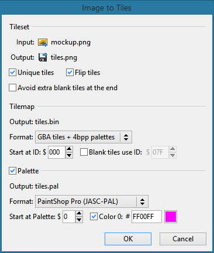

# Tilemap Studio 

A tilemap editor for Game Boy, GBC, GBA, NDS, SNES, Genesis, or TG16 projects. Specifically meant to support the [pret](https://github.com/pret) disassemblies like [pokered](https://github.com/pret/pokered), [pokecrystal](https://github.com/pret/pokecrystal), and [pokeemerald](https://github.com/pret/pokeemerald); as well as hacks including [Polished Crystal](https://github.com/Rangi42/polishedcrystal), [Red++](https://github.com/TheFakeMateo/RedPlusPlus), [Orange](https://github.com/PiaCarrot/pokeorange), [Prism](https://www.reddit.com/r/PokemonPrism), and many more.

Inspired by tools like [Tilemap Creator](https://github.com/erandis-vol/Tilemap-Creator), [NTME](https://www.pokecommunity.com/showthread.php?t=149454), [GSC Town Map Editor](https://hax.iimarckus.org/topic/97/) and [Karteneditor](https://i.imgur.com/70jDfdM.png), but implemented with C++ and [FLTK](http://www.fltk.org/), and with support for multi-platform tilemaps as well as Pokémon-specific formats.

Latest release: [**4.0.1**](https://github.com/Rangi42/tilemap-studio/releases/tag/v4.0.1)

Follow the steps in [INSTALL.md](INSTALL.md) to install the release copy of Tilemap Studio, or the longer instructions to build it yourself from source.

The [example/](example/) directory contains different formats of tilemaps and tileset graphics. In particular, [pokecrystal/town_map_pokegear.png](example/pokecrystal/town_map_pokegear.png) is a colored-in combination of tileset graphics from [pokecrystal](https://github.com/pret/pokecrystal), useful for viewing any Town Map in a project based on it.

Browse the menu items, toolbar buttons, and Help dialog to learn how to use Tilemap Studio. And don't miss the mouse controls:

|                      | Tileset        | Tilemap          |
|----------------------|----------------|------------------|
| **Click/drag**       | Select tile(s) | Place tiles      |
| **Middle drag**      | Scroll         | Scroll           |
| **Right-click**      | Highlight tile | Select tile      |
| **Right drag**       |                | Select tiles     |
| **Ctrl+click**       |                | Replace tile     |
| **Shift+click**      |                | Flood fill       |
| **Alt+click**        |                | Swap tiles       |

More information is at the [Gameboy Development Forum](https://gbdev.gg8.se/forums/viewtopic.php?id=648), [Skeetendo Forums](https://hax.iimarckus.org/topic/7691/) or [PokéCommunity](https://www.pokecommunity.com/showthread.php?p=10075626). If you have questions or comments, please go there.

